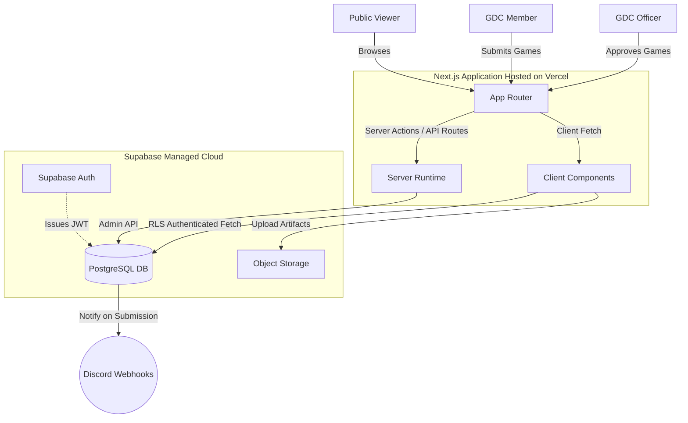

# System Architecture Overview

This document provides a high-level representation of the UPHSL Game Developers' Club (GDC) platform. Given the decisions finalized in ADR-001, we utilize a tightly-integrated Next.js foundation interfacing directly with Supabase.

## High-Level Architecture

The architecture relies heavily on Server-Side Rendering (SSR) for blazing-fast public delivery, and secure client-side data fetching governed by Row Level Security (RLS) for the dashboards.

## Components

### Component 1: Next.js Frontend (Vercel)
- **Purpose:** Serves the interactive public website and secure role-based member/officer dashboards. Combines statically generated pages for SEO and server-rendered routes for authenticated content.
- **Technology:** Next.js (App Router), React, Tailwind CSS.
- **Location:** `src/app/`

### Component 2: Supabase Backend
- **Purpose:** Acts as our integrated relational database, authentication provider, and file hosting service. Prevents the need for maintaining a discrete Node.js backend.
- **Technology:** PostgreSQL, Supabase Auth, Row Level Security (RLS) Policies.
- **Location:** Managed Cloud / `supabase/` migrations.

### Component 3: Discord Notification Webhooks
- **Purpose:** Integrates directly with Officer dashboards to ping leadership whenever a new game is submitted for review or a student application is received.
- **Technology:** External HTTP POST Webhooks.

## Data Flow

1. **Member Login:** Stored via Supabase Auth and issued a cryptographically secure JWT. The JWT is validated seamlessly directly within Next.js Server Components for route protection.
2. **Game Submission:** A GDC Member submits a new game form. Artifacts/Images are pushed directly to Supabase Object Storage. The relational data is inserted into the PostgreSQL `games` table.
3. **Approval Tracking:** A Postgres Database Webhook triggers a notification payload to the internal Officer Discord channel indicating a pending review.
4. **Officer Review:** An Officer securely queries the database via Next.js dashboard routes, protected by strict RLS policies ensuring only designated roles can modify the `status` of a submitted game to "Approved".

## Technology Stack

- **Frontend:** Next.js (React)
- **Backend Framework:** Next.js API Routes / Server Actions
- **Database:** Supabase (PostgreSQL)
- **Infrastructure:** Vercel (Edge network)
